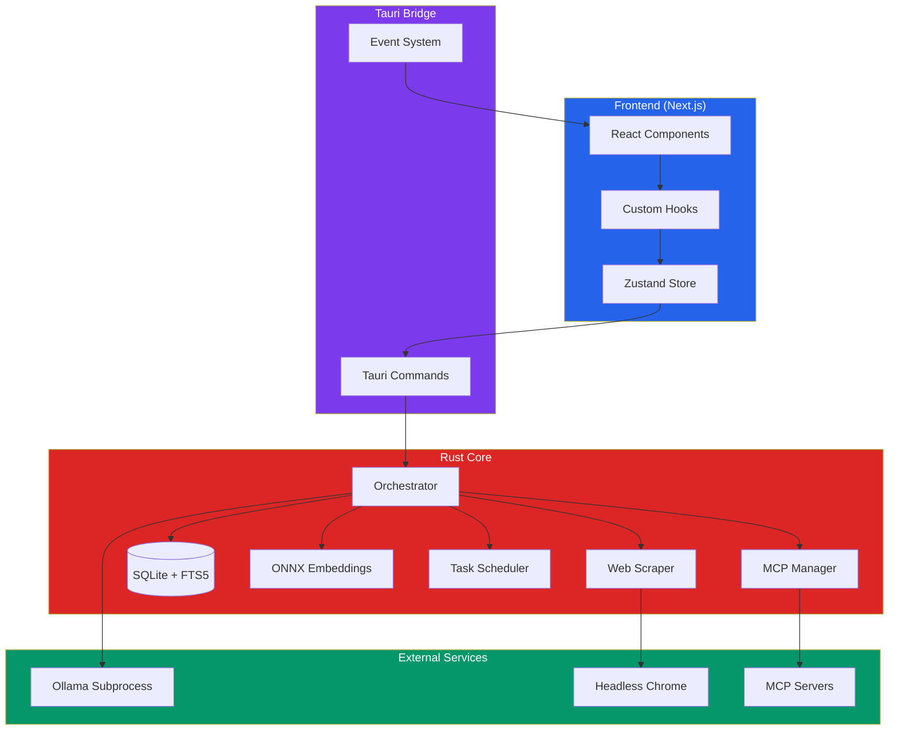

# OllaHub

Local-first LLM workspace with deep research capabilities and native OS integration.

[](https://www.rust-lang.org/)
[](https://tauri.app/)
[](https://nextjs.org/)
[](https://www.typescriptlang.org/)
[](LICENSE)
[](https://github.com/evandrodevbr/OllaHub)

## Overview

OllaHub is a desktop application that orchestrates local Large Language Models (LLMs) through Ollama, providing a private, offline-capable workspace for research, analysis, and conversation. The application executes complex research workflows by decomposing queries, performing parallel web scraping, and synthesizing context from multiple sources before generating responses.

The architecture prioritizes data privacy by keeping all processing local, using SQLite with full-text search for efficient storage, and integrating ONNX Runtime for semantic relevance ranking without external API dependencies.

## Key Features

### Deep Research Pipeline

The application implements a multi-stage research workflow:

1. **Query Decomposition**: Uses LLM to break complex queries into 3-5 atomic, search-optimized sub-queries
2. **Parallel Web Scraping**: Executes multiple searches concurrently using headless Chrome and DuckDuckGo metadata API
3. **Knowledge Base Aggregation**: Collects and deduplicates content from multiple sources
4. **Context Condensation**: Applies relevance scoring and summarization to fit context within token limits
5. **Validation**: Verifies knowledge base sufficiency before response generation

The pipeline includes safety checks to ensure decomposed queries remain relevant to the original intent, with automatic fallback to the original query if decomposition fails.

### Local-First Architecture

- **Ollama Integration**: Direct subprocess management of Ollama for model execution
- **ONNX Embeddings**: Local semantic similarity using all-MiniLM-L6-v2 (384-dimensional embeddings)
- **SQLite with FTS5**: Full-text search with virtual tables for session titles and message content
- **Hybrid Storage**: Dual persistence (SQLite + JSON) with automatic migration and fallback

### Hybrid Storage System

The application uses SQLite as the primary storage backend with JSON as a fallback:

- **SQLite (Primary)**: WAL mode for concurrent reads/writes, optimized cache settings, FTS5 virtual tables for search
- **JSON (Legacy)**: Maintained for backward compatibility and export functionality
- **Automatic Migration**: Seamless transition from JSON to SQLite with data preservation

### Reactive UI

Built with React 19 and Next.js 16, the interface uses:

- **Tailwind CSS**: Utility-first styling with design tokens
- **Radix UI / Shadcn**: Accessible, headless component primitives
- **Zustand**: Lightweight state management for settings and UI state
- **Framer Motion**: Smooth animations for state transitions
- **Resizable Panels**: Customizable layout with persistent preferences

### MCP (Model Context Protocol) Integration

Supports external tool integration through MCP servers:

- **JSON-RPC Communication**: Bidirectional communication with MCP servers via stdin/stdout
- **Tool Discovery**: Automatic enumeration of available tools from running servers
- **Process Management**: Lifecycle management (start, stop, restart) with health monitoring
- **Tool Execution**: Runtime invocation of MCP tools with result injection into LLM context

### System Monitoring

Real-time hardware monitoring and resource management:

- **GPU Detection**: NVIDIA and AMD GPU identification with utilization tracking
- **CPU/Memory Stats**: System-wide resource usage via `sysinfo` crate
- **Model Recommendations**: Hardware-aware model suggestions based on available VRAM/RAM

### Task Scheduler

Cron-based task execution system:

- **Recurring Tasks**: Schedule periodic operations (e.g., knowledge base updates)
- **Task Queue**: Priority-based execution with retry logic
- **State Persistence**: Task state survives application restarts

## Architecture



### Data Flow

1. **User Query** → Frontend captures input and triggers preprocessing
2. **Query Preprocessing** → Intent classification, entity extraction, query enrichment
3. **Deep Research** → Query decomposition → Parallel search → Scraping → Knowledge base aggregation
4. **Context Condensation** → Relevance scoring (ONNX embeddings) → Summarization → Token optimization
5. **LLM Generation** → Ollama subprocess with streaming response
6. **Storage** → SQLite persistence with FTS5 indexing for future retrieval

## Tech Stack

### Core

| Layer | Technology | Version | Purpose |
|-------|-----------|---------|---------|
| **Desktop Framework** | Tauri | 2.9.2 | Native desktop app with Rust backend |
| **Backend Language** | Rust | 1.77.2 | System-level operations, performance-critical paths |
| **Frontend Framework** | Next.js | 16.0.3 | React-based UI with SSR capabilities |
| **UI Library** | React | 19.2.0 | Component-based interface |
| **Language** | TypeScript | 5.0 | Type-safe frontend development |

### Frontend

| Category | Technology | Purpose |
|----------|-----------|---------|
| **State Management** | Zustand | 5.0.8 | Settings and UI state |
| **Styling** | Tailwind CSS | 4.0 | Utility-first CSS framework |
| **Components** | Radix UI | Latest | Accessible primitives (dialogs, dropdowns, tooltips) |
| **Components** | Shadcn/ui | Custom | Pre-built component library |
| **Animations** | Framer Motion | 12.23.24 | Smooth transitions |
| **Markdown** | react-markdown | 10.1.0 | Message rendering with GFM support |
| **Syntax Highlighting** | react-syntax-highlighter | 16.1.0 | Code block rendering |

### Backend

| Category | Technology | Purpose |
|----------|-----------|---------|
| **Database** | SQLite (rusqlite) | 0.31 | Local data persistence with FTS5 |
| **Web Scraping** | headless_chrome | 1.0 | Browser automation for content extraction |
| **HTML Parsing** | scraper | 0.18 | DOM parsing and content extraction |
| **Text Processing** | readability | 0.3 | Main content extraction from HTML |
| **HTTP Client** | reqwest | 0.12 | API requests with streaming support |
| **Async Runtime** | tokio | 1.0 | Async I/O and concurrency |
| **Task Scheduling** | tokio-cron-scheduler | 0.9 | Cron-based task execution |
| **System Info** | sysinfo | 0.36.1 | Hardware monitoring |
| **Embeddings** | ONNX Runtime (ort) | 2.0.0-rc.10 | Local semantic similarity |
| **Tokenization** | tokenizers | 0.21 | Text tokenization for embeddings |
| **Array Operations** | ndarray | 0.16 | Numerical computations |

### AI/ML

| Component | Technology | Purpose |
|-----------|-----------|---------|
| **LLM Runtime** | Ollama | Local model execution |
| **Embeddings Model** | all-MiniLM-L6-v2 | 384-dim semantic embeddings |
| **Embeddings Runtime** | ONNX Runtime | Model inference |

## Getting Started

### Prerequisites

- **Node.js**: 20.x or later
- **Rust**: 1.77.2 or later
- **pnpm**: Latest version (`npm install -g pnpm`)
- **Ollama**: [Install Ollama](https://ollama.ai) and ensure it's running on `http://localhost:11434`

### Installation

1. Clone the repository:
```bash
git clone https://github.com/evandrodevbr/OllaHub.git
cd OllaHub
```

2. Install dependencies:
```bash
pnpm install
```

3. Run in development mode:
```bash
pnpm tauri dev
```

This command will:
- Start the Next.js development server on `http://localhost:3000`
- Build the Rust backend
- Launch the Tauri application window

### Building for Production

```bash
pnpm tauri build
```

The built application will be in `src-tauri/target/release/bundle/`:
- **Windows**: `.msi` installer
- **macOS**: `.dmg` or `.app`
- **Linux**: `.deb`, `.AppImage`, or `.rpm`

### Environment Configuration

The application uses Tauri's built-in configuration. No environment variables are required for basic operation. MCP server configurations are stored in the application data directory and managed through the UI.

## Project Structure

```
OllaHub/
├── app/                    # Next.js app directory (pages)
│   ├── chat/              # Chat interface
│   ├── settings/           # Application settings
│   ├── setup/              # Initial setup wizard
│   └── tasks/              # Task management
├── components/             # React components
│   ├── chat/               # Chat-specific components
│   ├── settings/           # Settings UI components
│   ├── setup/              # Setup wizard components
│   └── ui/                 # Reusable UI primitives (Shadcn)
├── hooks/                  # React custom hooks
│   ├── use-chat.ts         # Chat state management
│   ├── use-deep-research.ts # Research pipeline orchestration
│   ├── use-mcp-servers.ts  # MCP server management
│   └── ...
├── lib/                    # Utility functions
│   ├── knowledge-base-processor.ts  # Context condensation
│   ├── contextual-analyzer.ts       # Query analysis
│   ├── query-enricher.ts            # Query expansion
│   └── ...
├── services/               # Service layer
│   └── webSearch.ts        # Web search abstraction
├── store/                  # Zustand stores
│   └── settings-store.ts   # Application settings
├── src-tauri/              # Rust backend
│   ├── src/
│   │   ├── lib.rs          # Main Tauri commands
│   │   ├── db.rs           # SQLite database layer
│   │   ├── embeddings.rs   # ONNX embeddings module
│   │   ├── web_scraper.rs  # Web scraping logic
│   │   ├── scheduler.rs    # Task scheduling
│   │   └── ...
│   └── Cargo.toml          # Rust dependencies
└── data/                   # Static data
    ├── models/             # Model metadata JSON files
    └── prompts/            # LLM prompt templates
```

## Design Patterns

### Backend (Rust)

- **Command Pattern**: Tauri commands encapsulate backend operations
- **State Management**: Arc<Mutex<>> for shared state (browser instances, MCP processes)
- **Error Handling**: Result<T, E> with custom error types and fallback strategies
- **Async/Await**: Tokio runtime for concurrent operations (scraping, MCP communication)

### Frontend (TypeScript)

- **Custom Hooks**: Encapsulate complex logic (deep research, chat management)
- **State Machines**: Step-based workflows (idle → planning → searching → aggregating)
- **Optimistic Updates**: UI updates before backend confirmation
- **Streaming**: Real-time token rendering via Tauri events

### Data Layer

- **Repository Pattern**: Database abstraction in `db.rs`
- **Migration Strategy**: Dual storage (SQLite + JSON) with automatic fallback
- **Full-Text Search**: FTS5 virtual tables with trigger-based synchronization

## Roadmap

### Planned Features

- **Vector Store Integration**: Replace SQLite BLOB embeddings with dedicated vector database (LanceDB or Qdrant)
- **Cloud Sync**: Optional encrypted synchronization of chat sessions across devices
- **Plugin System**: Extensible architecture for custom research workflows
- **Advanced RAG**: Multi-modal retrieval with image and document support
- **Model Fine-tuning UI**: Interface for training custom models on user data
- **Collaborative Features**: Shared workspaces and team collaboration

### Technical Improvements

- **Performance**: Optimize SQLite queries with prepared statements caching
- **Memory Management**: Implement LRU cache for embeddings model
- **Error Recovery**: Enhanced retry logic with exponential backoff
- **Testing**: Comprehensive unit and integration test coverage
- **Documentation**: API documentation with code examples

## Contributing

Contributions are welcome. Please follow these guidelines:

1. **Code Style**: Follow existing patterns (Rust: `rustfmt`, TypeScript: ESLint)
2. **Commits**: Use conventional commits (feat:, fix:, docs:, etc.)
3. **Pull Requests**: Include description of changes and test results
4. **Issues**: Use GitHub Issues for bug reports and feature requests

## License

OllaHub is released under a custom license that combines freeware, creditware, and non-commercial restrictions. See the [LICENSE](LICENSE) file for full terms.

### Quick Summary

**You may:**
- Use OllaHub freely for personal, educational, and internal professional use
- Modify and distribute the Software (with proper attribution)
- Fork the project and create derivative works (with attribution)

**You must:**
- Give credit to **Evandro Fonseca Junior** and link to [evandro.dev.br](https://evandro.dev.br)
- Keep copyright notices and attribution intact
- Not sell the Software or charge for access without written permission

**You may not:**
- Sell the Software or bundle it in paid products (without permission)
- Use it as a monetization mechanism
- Remove attribution or copyright notices
- Collect donations on behalf of OllaHub

For commercial licensing inquiries, visit [evandro.dev.br](https://evandro.dev.br).

## Acknowledgments

- [Ollama](https://ollama.ai) for local LLM execution
- [Tauri](https://tauri.app) for desktop framework
- [Radix UI](https://www.radix-ui.com) for accessible components
- [Shadcn](https://ui.shadcn.com) for component library
- [ONNX Runtime](https://onnxruntime.ai) for embeddings inference
