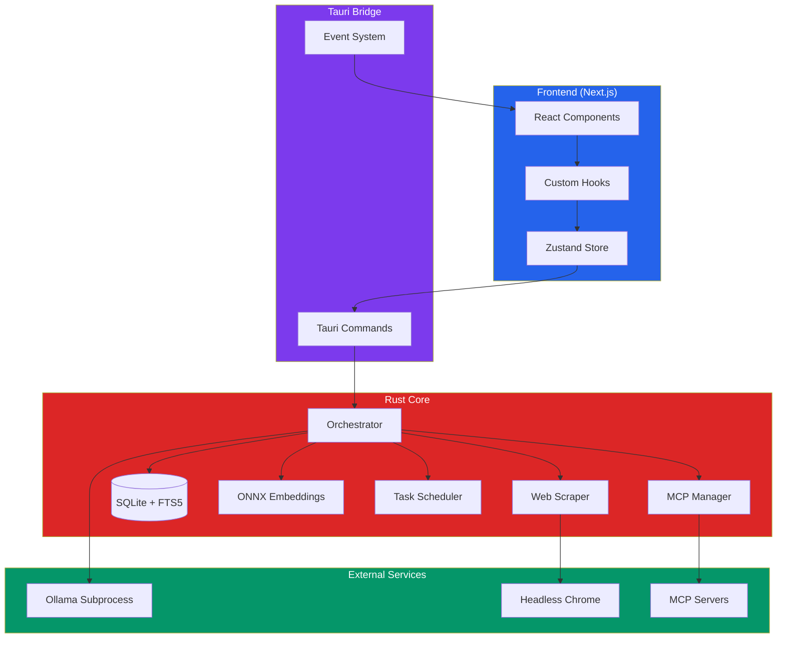

<div align="center">
  <h1>🧠 OllaHub</h1>
  <p><strong>Local-first LLM workspace with deep research capabilities and native OS integration.</strong></p>

  <p align="center">
    <a href="https://www.rust-lang.org/"></a>
    <a href="https://tauri.app/"></a>
    <a href="https://nextjs.org/"></a>
    <a href="https://www.typescriptlang.org/"></a>
    <a href="LICENSE"></a>
  </p>

  <br>

  </div>

---

## 🌟 Why OllaHub?

OllaHub is a powerful desktop application that orchestrates local Large Language Models (LLMs) through **Ollama**, providing a private, offline-capable workspace for research, analysis, and conversation. 

Unlike standard chat interfaces, OllaHub executes **complex research workflows** by decomposing queries, performing parallel web scraping, and synthesizing context from multiple sources before generating responses—all while keeping your data 100% local and private.

---

## ✨ Key Features

### 🔍 Deep Research Pipeline
OllaHub doesn't just answer; it researches. Our multi-stage pipeline includes:
1. **Query Decomposition:** Uses the LLM to break complex queries into 3-5 atomic, search-optimized sub-queries.
2. **Parallel Scraping:** Executes concurrent searches using headless Chrome and the DuckDuckGo metadata API.
3. **Knowledge Aggregation:** Collects, deduplicates, and cleans content from multiple sources.
4. **Context Condensation:** Applies relevance scoring (ONNX embeddings) and summarization to fit context within token limits.
5. **Validation:** Verifies knowledge base sufficiency before response generation, with safety fallbacks.

### 🛡️ Local-First & Privacy-Focused
* **Ollama Integration:** Direct subprocess management for seamless local model execution.
* **Local Semantic Search:** Powered by ONNX Runtime (`all-MiniLM-L6-v2` 384-dimensional embeddings) with no external API calls.
* **Hybrid Storage:** Blazing fast SQLite (FTS5 for full-text search) with JSON fallbacks for backward compatibility and data safety.

### 🔌 MCP (Model Context Protocol) Integration
Extensible by design. Connect external tools via MCP servers:
* **Tool Discovery:** Automatic enumeration of available tools from running servers.
* **Process Management:** Full lifecycle control (start, stop, restart) with health monitoring.
* **Tool Execution:** Runtime invocation of tools with direct result injection into the LLM context.

### ⚡ Reactive & Customizable UI
Built with **React 19, Next.js 16, and Tailwind CSS**. Features smooth animations (Framer Motion), accessible primitives (Radix UI/Shadcn), resizable panels, and lightweight state management (Zustand).

---

## 🏗️ System Architecture

<details>
<summary><b>Click to view Architecture Diagram</b></summary>


```mermaid
graph TB
    subgraph Frontend["Frontend (Next.js)"]
        UI[React Components]
        Hooks[Custom Hooks]
        Store[Zustand Store]
    end
    
    subgraph Bridge["Tauri Bridge"]
        Commands[Tauri Commands]
        Events[Event System]
    end
    
    subgraph Backend["Rust Core"]
        Orchestrator[Orchestrator]
        Scraper[Web Scraper]
        DB[(SQLite + FTS5)]
        Embeddings[ONNX Embeddings]
        Scheduler[Task Scheduler]
        MCP[MCP Manager]
    end
    
    subgraph External["External Services"]
        Ollama[Ollama Subprocess]
        Chrome[Headless Chrome]
        MCP_Servers[MCP Servers]
    end
    
    UI --> Hooks
    Hooks --> Store
    Store --> Commands
    Commands --> Orchestrator
    Orchestrator --> Scraper
    Orchestrator --> DB
    Orchestrator --> Embeddings
    Orchestrator --> Scheduler
    Orchestrator --> MCP
    Scraper --> Chrome
    Orchestrator --> Ollama
    MCP --> MCP_Servers
    Events --> UI
    
    style Frontend fill:#2563eb,color:#fff
    style Bridge fill:#7c3aed,color:#fff
    style Backend fill:#dc2626,color:#fff
    style External fill:#059669,color:#fff

```

</details>

---

## 🚀 Getting Started

### Prerequisites

Before you begin, ensure you have the following installed:

* **Node.js**: `v20.x` or later
* **Rust**: `v1.77.2` or later
* **pnpm**: Latest version (`npm install -g pnpm`)
* **[Ollama](https://ollama.ai)**: Must be running locally on `http://localhost:11434`

### Installation & Development

1. **Clone the repository:**
```bash
git clone [https://github.com/evandrodevbr/OllaHub.git](https://github.com/evandrodevbr/OllaHub.git)
cd OllaHub

```


2. **Install dependencies:**
```bash
pnpm install

```


3. **Run in development mode:**
```bash
pnpm tauri dev

```


*This starts the Next.js server (`localhost:3000`), builds the Rust backend, and launches the Tauri native window.*

### Building for Production

```bash
pnpm tauri build

```

*Compiled binaries will be available in `src-tauri/target/release/bundle/` (.msi, .dmg, .app, .deb, etc.).*

---

## 💻 Tech Stack Deep Dive

<div align="center">

</div>


| Layer | Technologies Used | Purpose |
| --- | --- | --- |
| **Core** | Tauri 2.9, Rust 1.77 | Native desktop environment, high-performance system I/O, concurrency (Tokio). |
| **Frontend** | Next.js 16, React 19, TS | SSR-capable UI, Zustand (State), Framer Motion (Animations), Tailwind/Radix. |
| **Database** | SQLite (rusqlite 0.31) | FTS5 virtual tables for lightning-fast full-text search and session storage. |
| **AI / ML** | Ollama, ONNX Runtime | Local LLM execution and 384-dim semantic embeddings (`all-MiniLM-L6-v2`). |
| **Scraping** | headless_chrome, scraper | Parallel web automation, DOM parsing, and readability extraction. |

---

## 🗺️ Roadmap

* [ ] **Vector Store Integration**: Transition from SQLite BLOB embeddings to a dedicated vector DB (LanceDB or Qdrant).
* [ ] **Advanced RAG**: Multi-modal retrieval supporting images, PDFs, and local documents.
* [ ] **Cloud Sync**: Optional E2E encrypted synchronization of chat sessions across devices.
* [ ] **Custom Plugin System**: Extensible architecture for user-defined research workflows.
* [ ] **Model Fine-Tuning UI**: Native interface for training custom models on personal knowledge bases.

---

## ⚖️ License & Terms

OllaHub is released under a custom license combining freeware and creditware models. See the [LICENSE](https://www.google.com/search?q=LICENSE) file for full legal terms.

**TL;DR:**

* ✅ **You may:** Use freely for personal/educational/internal use, modify, and fork the project.
* ✅ **You must:** Give visible credit to **Evandro Fonseca Junior** and link to [evandro.dev.br](https://evandro.dev.br). Keep copyright notices intact.
* ❌ **You may not:** Sell the software, bundle it in paid products, or monetize it without explicit written permission.

For commercial licensing inquiries, please contact me via [evandro.dev.br](https://evandro.dev.br).

---

<div align="center">
<p>Built by <a href="https://github.com/evandrodevbr">Evandro Fonseca Junior</a></p>
</div>

```
